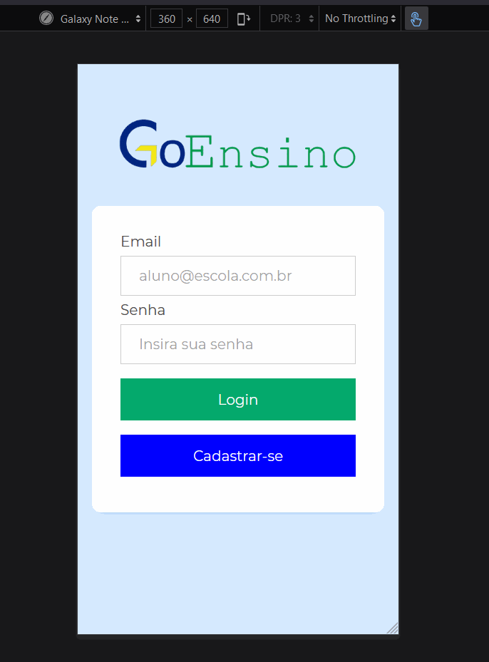
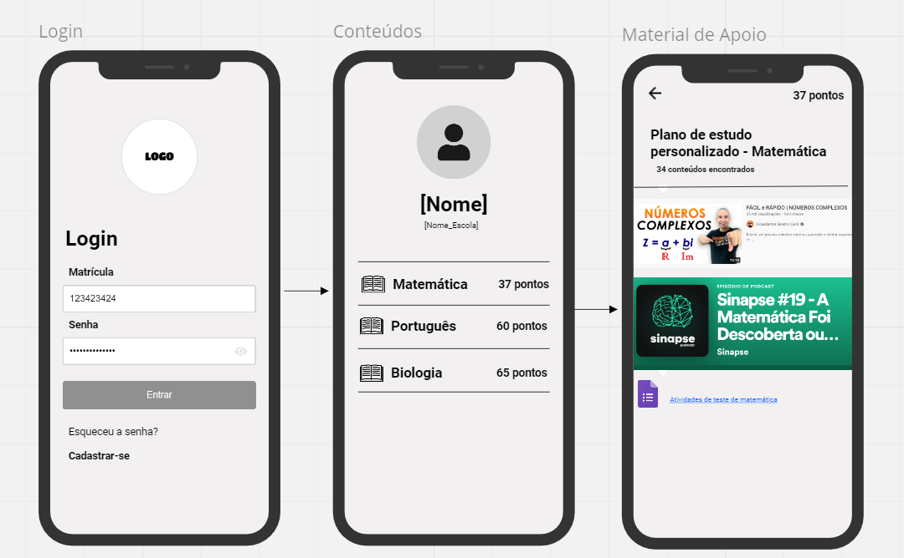

# Go Ensino

## Descrição
GoEnsino é uma plataforma gamificada que analisa dados de educação e recomenda conteúdos com o objetivo de auxiliar alunos com dificuldades em matérias do ensino médio. A plataforma visa promover a conexão e o engajamento entre os alunos e instituição, e alunos com outros alunos que podem auxiliá-los (mentores). O modelo de recomendação é retroalimentado a partir dos feedbacks do estudante, a fim de se adaptar melhor ao modo como cada aluno aprende.

## Ideia inicial

# Instalação e execução
## Pré-requisitos
- [Node JS](https://nodejs.org/en/download/)
- NPM
- React

## Passos
### Acesso
Acesse nossa plataforma em [https://goensino.herokuapp.com/](https://goensino.herokuapp.com/)

### Instalação e execução
Caso deseje instalar e executar a aplicação, siga os passos abaixo:
- Baixe ou clone este repositório (`git clone https://github.com/GoEnsino/GoEnsino.git`)
- Dentro do diretório do projeto, instale as dependências com `npm install`.
- Então execute o comando `npm start`.
- Uma nova janela será aberta com a aplicação executando.

# Tecnologias utilizadas
- React
- Javascript
- React Navigation
- Flex
- HTML
- CSS
